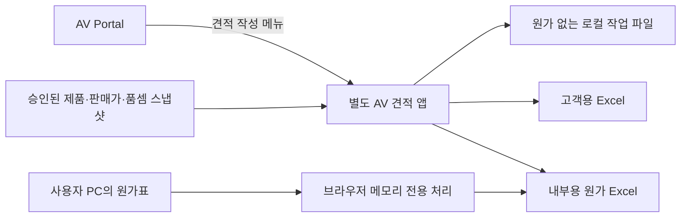

# AV 견적 프로그램 구현 설계서 — Claude Code 인계용

작성일: 2026-10-03
버전: 1.0
상태: 구현 전 설계안
구현 담당: Claude Code

## 0. 목적과 적용 범위

### 목표

교육장·회의실·강당 등의 기본 구성을 선택하고, 제품과 필수 부자재를 추가·교체하면서 웹에서 견적을 완성한다.

제공한 회사 견적서와 같은 구성의 **수식이 살아 있는 Excel**을 내려받는다. 필요할 때만 사용자의 PC에서 원가표를 읽어 내부 원가를 계산한다.

다운로드 후 사람이 Excel에서 필수 계산·행 정리·서식 복구를 해야 한다면 웹 완성 요구를 충족한 것이 아니다. Excel에서의 추가 편집은 사용자의 선택이어야 한다.

### 디자인 필수 조건

사용자의 최신 지시:

> 디자인컨셉은 알티컴, LED 구성기 그대로 계승.

기존 RTCOM·LED 구성기의 헤더·색상·글꼴·버튼·입력창·카드·탭·간격을 계승한다.

견적 본문은 제공된 Excel의 열·머리글·행 구조를 따른다. 새로운 별도 테마를 임의로 만들지 않는다.

### 문서의 성격

이 문서는 요구사항, 제안 구조, 파일 분석 결과, 구현 순서 및 검증 기준을 담은 전달용 문서다.

제품 구현·배포 완료 보고나 AV Portal의 READY 작업 명세가 아니다. 기존 RTCOM·LED 계산 로직의 변경을 지시하지 않는다.

회사 자료의 실제 매입 가격은 이 설계서에 수록하지 않았다.

기술 인터페이스는 견적 앱 내부의 제안이며 AV Portal의 최종 Product Data Schema를 확정하는 문서가 아니다.

### 확정 요구사항과 설계 제안

| 구분 | 내용 |
|---|---|
| 사용자 요구 | 웹에서 최종 견적 완성 |
| 사용자 요구 | Excel과 유사한 표, 수식 포함 다운로드 |
| 사용자 요구 | 샘플 선택 또는 빈 견적 시작 |
| 사용자 요구 | 품목 추가·삭제·교체·순서 변경 |
| 사용자 요구 | HDMI 등 브랜드·길이·모델별 선택 |
| 사용자 요구 | 필수 케이블 자동 선택 또는 추천 |
| 사용자 요구 | 표준품셈 및 노무비 일위대가 확인 |
| 사용자 요구 | 원가표는 필요할 때만 적용 |
| 사용자 요구 | AI·GitHub·외부 서버로 매입 원가 전송 금지 |
| 사용자 요구 | RTCOM·LED 구성기의 디자인 계승 |
| 추천 구조 | 별도 견적 앱을 만들고 AV Portal 메뉴에서 연결 |
| 미확정 운영 결정 | 새 저장소·도메인·호스팅 |
| 미확정 운영 결정 | 공개 판매단가 범위, 인증 필요 여부 |
| 구현 전 확인 사항 | 전체 간접비 기준, 품셈 대응표 |
| 구현 전 확인 사항 | 인쇄 세부 서식, 목표 Excel 버전 |

---

## 1. 서비스 구성 결정안

### 권장: 별도 견적 앱 + AV Portal 진입 링크

견적은 행 편집·수식·인쇄·파일 입출력·원가 처리가 중심인 업무 도구다.

독립 앱으로 개발하면 별도 배포와 회귀 검증이 가능하다. 사용자는 같은 디자인과 포털의 진입 링크를 통해 하나의 서비스군으로 느끼게 한다.



### 운영 원칙

- 초기 버전은 정적 웹 앱과 로컬 파일 입출력으로 구현할 수 있다.
- 회사 IP 내부에만 제한하지 않는다.
- 회사 밖 접속 허용과 데이터 공개는 별도 문제다.
- 웹에 배포하는 제품 목록·판매가·품셈 자료의 공개 범위를 먼저 분류한다.
- 로그인 화면만 덧붙이고 공개 정적 파일에 비공개 가격을 넣지 않는다.
- 비공개 판매가까지 원격 제공해야 한다면 인증·인가가 있는 서버 설계가 추가로 필요하다.
- 초기안에서는 승인된 공개 데이터 또는 사용자가 로컬에서 선택한 데이터만 사용한다.
- 격리가 필요하면 별도 origin으로 배포한다.
- 같은 `seoulav.github.io`의 다른 경로는 별도 origin이 아니다.
- 저장소를 나누는 것만으로 브라우저 저장소가 분리되지 않는다.
- 새 도메인·저장소 생성과 AV Portal 메뉴 반영은 실제 구현 착수 범위가 정해진 뒤 수행한다.
- 기존 구성기의 서버·데이터베이스·공유 기능을 자동으로 연결하지 않는다.

참고:
https://developer.mozilla.org/en-US/docs/Web/Security/Defenses/Same-origin_policy

---

## 2. 디자인 계승 명세

### 2.1 기준 화면

1. RTCOM Configurator
   https://seoulav.github.io/rtcom-configurator/

2. LED Configurator
   https://hkkim0454.github.io/svt-led-calculator/src/index.html

기존 제품 기획에 기록된 방향:

- 밝은 White / Light Gray
- Blue Accent
- 일부 Blue-Purple Gradient
- 둥근 카드
- 부드러운 그림자
- Pill Tab

정확한 색상값·크기·그림자는 실제 기존 소스와 화면에서 추출한다. 아직 확인하지 않은 디자인 토큰 값을 만들어 확정하지 않는다.

### 2.2 계승 방법

- 두 앱의 실제 공개 화면과 사용할 수 있는 소스를 확인한다.
- `docs/design/reference-map.md`에 기준 URL·확인일·소스 경로·컴포넌트 대응을 기록한다.
- 공통 요소는 그대로 재사용한다.
- 서로 다른 요소는 견적 앱에 필요한 역할을 기준으로 어느 앱의 패턴을 따랐는지 기록한다.
- 새로운 제3의 테마를 만들지 않는다.
- 다음 항목을 `src/styles/tokens.css`로 정리한다.
  - 색상
  - 글꼴과 숫자 표시
  - 제목 단계
  - 헤더 높이
  - 버튼·입력 높이
  - 모서리
  - 간격
  - 카드 그림자
  - 선택·오류·비활성 상태
- 스타일 계승과 실행 코드 재사용을 구분한다.
- 기존 원가표 저장·공유·스크립트 import 로직은 그대로 가져오지 않는다.
- 기존 예시 HTML은 기능 설명용이다. 최종 디자인의 기준이나 검증된 제품 코드로 취급하지 않는다.

### 2.3 화면 구성

```text
[기존 구성기 계열 헤더]     AV 견적       포털로 돌아가기

[샘플 선택] [새 견적] [작업 파일 열기] [저장] [Excel 다운로드]

공사명 / 고객명 / 작성일 / 견적번호 / 견적 조건
──────────────────────────────────────────────────────────

제품 검색·필터       │ Excel 형태의 견적 작업 영역
브랜드 / 분류 / 길이 │ [갑지][시스템별 내역][일위대가][합계]
체크하여 추가       │ 번호│품명│규격│단위│수량│재료비│노무비│합계│비고
                    │ 직접비 → 간접비 → 시스템 합계

──────────────────────────────────────────────────────────
필수 부자재 검토:
필요한 이유 / 구간 / 사양 / 길이 / 수량 / 선택
──────────────────────────────────────────────────────────

절사 전 합계 / 절사액 / NEGO / 최종 공급금액 / VAT 별도
```

### 2.4 편집 화면 원칙

- 견적 표의 2단 머리글·열 순서·소계 구조를 유지한다.
- 품목을 카드로만 보여주지 않는다.
- 브랜드·길이·추가 버튼은 제품 검색 또는 행 상세 패널에 둔다.
- 인쇄 견적 표에 임의의 새 열을 넣지 않는다.
- 고정 머리글과 숫자 우측 정렬을 제공한다.
- 키보드 이동과 복사·붙여넣기를 지원한다.
- 행 추가·삭제·복제·이동을 지원한다.
- 실행 취소/다시 실행을 지원한다.
- 입력 가능한 값과 자동 계산값을 구별한다.
- 계산 셀은 기본적으로 직접 수정하지 않는다.
- 명시적인 수동 단가 전환에는 사유를 남긴다.
- 모바일은 표 구조를 보존한 가로 스크롤과 접이식 제품 패널을 사용한다.
- 페이지 전체의 가로 넘침과 표 내부 스크롤을 구분한다.
- 편집 모드와 인쇄 미리보기를 분리한다.
- 편집 화면의 픽셀 크기와 Excel 인쇄물의 페이지 치수를 동일하다고 보장하지 않는다.

최종 검수는 두 항목으로 진행한다.

1. 기존 구성기와 나란히 비교한 앱 외형
2. 원본 Excel과 비교한 견적 표·인쇄물

---

## 3. 사용자 작업 흐름

1. 교육장·회의실·강당 샘플 또는 빈 견적 선택.
2. 공사명·고객·작성일·조건 입력.
3. 시스템 이름과 순서 설정.
4. 제품 검색 후 체크하여 추가.
5. 브랜드·모델·길이·단위를 확인하고 수량 입력.
6. 실제 장비 간 연결과 설치 구간·거리 입력.
7. 필수 케이블 추천 또는 자동 추가 결과 확인.
8. 품셈 항목 연결, 일위대가와 노무 단가 확인.
9. 불명확한 매핑은 확인 필요로 표시.
10. 직접비·간접비·절사·NEGO와 갑지 확인.
11. 미해결 필수 항목 수정.
12. 필요할 때만 `원가표 불러오기 — 이 기기에서 처리`로 원가 계산.
13. 고객용 또는 내부용 Excel 다운로드.
14. 일반 작업 파일 저장에는 원가를 포함하지 않음.
15. 원가 지우기 또는 페이지 종료.
16. 원가표 재적용은 사용자가 다시 파일을 선택해야 함.

### 견적 모드

- 재료비 + 노무비 견적
- 노무비 전용 견적

노무비 전용 모드도 계산 근거가 되는 제품·수량은 유지하고 출력 재료비의 표시 정책을 별도로 정의한다.

단가 미등록을 0원으로 표시해 견적을 완성시키지 않는다.

---

## 4. Excel 자료와 사용 우선순위

### 4.1 최종 고객용 양식 기준

파일:

`견적서(NEGO)_평택 사무3동 6층 CLEAN IEC 룸 AV시스템 납품설치_260826.xlsx`

SHA-256:

`57ab58c19db062830d99eff4eebb1fd952e4c060673ced73008b47ce3c080922`

| 시트명 | 현재 인쇄 범위 | 갑지 참조 |
|---|---|---|
| 갑지 | A1:J21 | 합계·절사·NEGO |
| `LED Display ` — 끝 공백 있음 | A1:K35 | G11 ← J35 |
| IP KVM시스템 | A1:K37 | G12 ← J37 |
| 월컨트롤 시스템 | A1:K55 | G13 ← J55 |
| 웹화상회의 시스템 | A1:K30 | G14 ← J30 |
| 랙 및 케이블 배관배선 | A1:K31 | G15 ← J31 |

모두 가로 방향이다.

위 셀 좌표는 원본 분석 좌표이며 행이 늘어난 출력에 하드코딩하는 좌표가 아니다.

프로젝트별 시스템 추가·삭제·이름 변경·순서 변경을 지원한다.

### 4.2 최종 내역서 열

| 실제 열 | 표시/역할 |
|---|---|
| A | 번호 |
| B | 품 명 |
| C | 규 격 — 모델명 또는 규격 표현 |
| D | 단위 |
| E | 수량 |
| F / G | 재료비 단가 / 금액 |
| H / I | 노무비 단가 / 금액 |
| J | 합 계 |
| K | 비 고 |

서식:

- A1:K1 제목 병합, 갑지 공사명 참조.
- 2–3행은 2단 머리글.
- 재료비 F:G·노무비 H:I는 상단 가로 병합.
- 나머지는 세로 병합.
- 직접비 품목 → 직접비계 → 간접비 항목 → 간접비계 → 합계.
- 새 양식에는 이전 품셈 견적의 숨김 D열 `설명`이 없다.
- 원본 H열의 확인한 대표 노무 단가는 숫자다.
- 이 파일만으로 일위대가 전체를 복원할 수 없다.

### 4.3 품셈·일위대가 구조 참고

파일:

`견적서_6-3라인 6층 교육장 개선_260522_품셈.xlsx`

이전 양식:

- A: 번호
- B: 품명
- C: 규격
- D: 설명 — 숨김
- E: 단위
- F: 수량
- G:H: 재료비
- I:J: 노무비
- K: 합계
- L: 비고

최종 양식의 셀 좌표와 혼용하지 않는다.

원본 뒤쪽 열:

- P: 품셈 항목
- Q: 품목별 요율
- R: 할증
- S: 표준단가
- T:BA: 직종별 품과 노임 계산

대표 식:

```text
U7 = T7 * U$3
     해당 직종 품 × 노임

S7 = SUM(U7,W7,...,BA7)
     직종별 노무 금액 합계

I7 = INT(SUM(R7*S7,S7)*Q7)
     할증과 품목별 요율 적용 노무 단가

J7 = F7*I7
     수량 × 노무 단가
```

원본의 품·노임·요율·할증의 단위와 적용 범위를 검증하고, 최종 양식 H열 노무 단가로 연결한다.

회사 기준의 계산식 확인과 법적 요율 판단은 같은 작업이 아니다.

### 4.4 표준품셈 데이터베이스

파일:

`원가삭제_2026상반기_표준품셈_260408.xlsx`

16개 시트, 숨김 시트 및 내부 메모가 있다.

선행 분석에서 깨진 정의 이름 98개, 캐시된 `#REF!` 12셀을 발견했다. 추출 시 다시 검증하고 오류가 있는 항목은 별도 격리한다.

파일명이 `원가삭제`라는 이유로 전체 공개를 허용하지 않는다.

### 4.5 자료 접근과 취급

분석 당시 원본 위치:

```text
C:\Users\khk00\.paseo\uploads\upload_a728fa9d-e438-46b8-a177-33293375409a\견적서(NEGO)_평택 사무3동 6층 CLEAN IEC 룸 AV시스템 납품설치_260826.xlsx

C:\Users\khk00\.paseo\uploads\upload_0b96eb24-d00d-478a-8ff1-a3e32ac8220d\견적서_6-3라인 6층 교육장 개선_260522_품셈.xlsx

C:\Users\khk00\.paseo\uploads\upload_08ec1814-0517-42c2-9ae0-6bbcff2cf3c4\원가삭제_2026상반기_표준품셈_260408.xlsx
```

취급 원칙:

- 다른 PC나 Claude Code 환경에 위 파일이 자동으로 전달되는 것은 아니다.
- 착수 시 실제 파일 존재 여부부터 확인한다.
- 원본이 없으면 합성 데이터로 진행하고 원본 대조 단계를 미완료로 기록한다.
- 사용자가 철회한 PDF는 사용하지 않는다.
- 별도 원가 견적 원본은 사용자의 폐기 요청 대상이며 구현 자료로 요구하지 않는다.
- 실제 매입 원가를 다시 AI에 첨부할 필요가 없다.
- 파서 개발에는 익명화된 열 구조와 합성 가격만 사용한다.
- 원본 전체를 로그·대화·Git으로 출력하지 않는다.
- 셀 구조·수식·서식 메타데이터만 필요한 범위에서 추출한다.
- 원본은 읽기 전용으로 보존한다.

현재 분석 범위는 구조와 대표 수식이다.

아직 수행하지 않은 검증:

- 전체 간접비 항목과 적용 기준 검증
- 모든 원본 페이지 렌더링 대조
- 완성 출력물의 Excel 재계산 검증

---

## 5. 계산 모델

### 5.1 원칙

웹 화면과 Excel 출력이 동일한 계산 정의를 사용한다.

웹 계산과 Excel 수식을 서로 다른 곳에서 임의로 작성하지 않는다.

통화는 Decimal 연산을 사용하고 절사 위치를 명시한다.

JavaScript `eval`로 파일의 수식을 실행하지 않는다.

연산 모델은 회사 양식에 필요한 제한된 연산만 지원한다.

- multiply
- sum
- floor
- roundDown
- reference

일반적인 모든 Excel 함수를 구현하는 프로젝트로 확대하지 않는다.

참고:
https://mikemcl.github.io/decimal.js/

### 5.2 직접비·노무비

```text
재료비 금액
= 수량 × 판매 단가

표준 노무 단가
= Σ(직종별 품 × 해당 연도/반기 노임)

적용 노무 단가
= INT(표준 노무 단가 × (1 + 할증) × 품목별 요율)

노무비 금액
= 수량 × 적용 노무 단가

품목 합계
= 재료비 금액 + 노무비 금액
```

INT는 음수에서 단순 소수점 버림과 다르다.

양수 입력 범위를 기본으로 검증하고, 허용된 음수 조정행은 별도 연산 정책을 사용한다.

수량 소수 허용은 단위별로 정의한다.

### 5.3 일위대가 화면

다음 항목을 표시한다.

- 품셈 코드
- 품셈 내용
- 산출 단위
- 출처와 개정
- 직종
- 직종별 품
- 노임
- 직종별 금액
- 할증
- 품목별 요율
- 절사 방법
- 최종 단가

품셈의 기준 단위와 판매 단위가 다르면 환산 계수를 명시한다.

미연결 항목은 수동 노무 단가와 그 사유를 기록하고 `품셈 검증 완료`로 표시하지 않는다.

### 5.4 간접비

항목별로 다음을 구조화한다.

- 기준 금액
- 요율
- 절사
- 적용 조건
- 출처

원본 LED 시트에서 확인한 대표식:

```text
J25 = INT(I23*E25)
      간접노무비

J26 = INT(I23*E26)
      고용보험료

J27 = INT(I23*E27)
      산재보험료

J31 = INT(J23*E31)
      산업안전보건관리비

J33 = INT(SUM(J23,J25,J31)*E33)
      항목명·적용 조건은 원본 추가 대조 필요

J34 = SUM(J25:J33)

J35 = J23+J34
```

J28:J30 등에 존재하는 숫자 또는 빈칸은 확인 전 일괄 수식화하지 않는다.

모든 공사에 같은 보험·경비 요율을 적용하지 않는다.

불명확한 항목은 사용자 기준을 받아 매핑한다. 법정 요율로 소개하려면 그때의 공식 기준을 확인한다.

### 5.5 갑지·절사·NEGO

```text
시스템 금액
= 시스템 수량 × 시스템 합계

H16 = ROUNDDOWN(SUM(H11:H15),-4)
      만원 미만 절사

H17 = -NEGO차감액
      원본은 음수 입력값

H18 = SUM(H16:H17)

금액 문구
= H18의 한글 금액 + 숫자 금액 + V.A.T 별도
```

웹에서는 차감액을 양수로 입력받고 출력에서는 음수 조정액으로 바꾼다.

다음을 방지한다.

- 이중 차감
- 공급금액보다 큰 할인
- VAT 중복 추가

갑지 행 개수가 달라지면 참조 범위를 함께 다시 만든다.

### 5.6 합성 검증 예제

아래 값은 회사 가격이 아닌 테스트 값이다.

| 검증 | 입력 | 기대 결과 |
|---|---|---|
| 갑지 | 시스템 1,234,567 + 2,345,678 | 절사 전 3,580,245 |
| 절사 | 위 합계, 만원 단위 | 3,580,000 |
| NEGO | 차감 80,000 | 3,500,000, VAT 별도 |
| 일위대가 | 0.06×200,000 + 0.03×100,000 | 표준 단가 15,000 |
| 할증·요율 | 15,000 × 1.1 × 1.2 | 노무 단가 19,800 |
| 노무 금액 | 위 단가 × 수량 2 | 39,600 |
| 가격 미등록 | 판매 단가 없음 | 0 처리하지 않고 확정 차단 |

---

## 6. 제품·샘플·견적 데이터 구조

### 6.1 제품과 설치 행을 분리

같은 HDMI 모델을 강의대와 랙에 각각 사용할 수 있다.

`rowId`와 `productId/SKU`를 동일하게 만들지 않는다.

이름만 같은 케이블도 브랜드·길이·방향성·규격이 다르면 다른 SKU다.

```typescript
type DecimalText = string;

type EvidenceState =
  | 'verified'
  | 'review-required'
  | 'conflicted';

interface ProductVariant {
  productId: string;
  sku: string;

  brand: string;
  model: string;

  quoteName: string;
  quoteSpec: string;

  unit: string;
  lengthM?: DecimalText;
  options: Record<string, string>;

  // 공개 승인 또는 로컬 입력된 판매가
  sellingUnitPrice?: DecimalText;
  currency: 'KRW';

  laborMappingId?: string;
  evidence: EvidenceState;

  // 원가와 매입처 필드는 이 타입에 두지 않음
}

interface QuoteRow {
  rowId: string;
  systemId: string;

  productId?: string;
  sku?: string;

  name: string;
  specification: string;

  unit: string;
  quantity: DecimalText;
  sellingUnitPrice?: DecimalText;

  laborMode:
    | 'mapped'
    | 'manual'
    | 'not-applicable'
    | 'unresolved';

  laborMappingId?: string;
  manualLaborUnitPrice?: DecimalText;
  overrideReason?: string;

  location?: string;
  remark: string;

  origin: 'manual' | 'sample' | 'rule';
  ruleInstanceId?: string;
}
```

### 6.2 추가 엔터티

| 이름 | 주요 역할 |
|---|---|
| QuoteDocument | 문서 버전·기본정보·시스템·행·연결·계산 정책·NEGO |
| SampleTemplate | 교육장/회의실/강당 기본 행, 연결 구조, 수량 변수, 버전 |
| EquipmentInstance | 실제 장비 인스턴스 |
| Port | 방향·신호·수량·조건·근거 |
| Connection | 출발/도착 장비·포트, 경로, 길이, 요구 신호, 수량 |
| LaborItem | 품셈 근거·기준 단위·직종별 품 |
| WageTable | 연도/반기 노임 |
| LaborMapping | SKU와 품셈 연결, 환산, 요율·할증·확인 상태 |
| IndirectCostRule | 참조하는 합계·항목, 요율, 절사, 적용 여부·근거 |
| AccessoryAllocation | 연결 구간과 제공/기존/견적 케이블의 배정 수량 |
| CalculationSnapshot | 계산 결과·경고·사용 버전·출력용 수식 정의 |
| PrivateCostSession | 메모리 전용 원가표와 내부 계산 결과 |

PrivateCostSession은 영속 객체에 포함하지 않는다.

### 6.3 작업 파일 저장

작업 파일에는 다음 버전을 보존한다.

- catalog
- labor
- wage
- template
- rule

계산에 사용한 판매가·노임의 스냅샷도 보존한다.

다시 열 때 새 카탈로그로 조용히 가격을 바꾸지 않는다. 명시적인 업데이트·차이 확인을 제공한다.

저장하지 않을 정보:

- 매입 원가
- 매입처
- 원가표 파일명
- 내부 원가 계산 결과

고객·프로젝트 정보가 들어간 작업 파일은 사용자 로컬 저장 대상으로 취급한다.

---

## 7. 필수 부자재 추천 엔진

### 7.1 실제 연결을 기준으로 판단

제품 두 개가 견적에 존재한다는 이유만으로 연결을 단정하지 않는다.

실제 연결 구간과 포트를 기준으로 판단한다.

| 연결 | 필요한 항목 | 추가 확인 |
|---|---|---|
| PC HDMI OUT → TV HDMI IN | HDMI 케이블 | 설치 거리, 신호 조건, 단자, 방향성, 기존 케이블 |
| HDBaseT TX → RX | 해당 조건을 만족하는 Category 케이블 | 모델 조합, 버전·거리·차폐·배선 조건·전원 방식 |
| PC → TX → RX → TV | 입력 HDMI + HDBaseT 구간 케이블 + 출력 HDMI | 각 구간을 별도 연결로 계산 |
| TX → HDBaseT 수신 내장 디스플레이 | 전송 구간 케이블 | 실제 내장 수신·호환 근거 확인, RX 중복 추가 방지 |
| 앰프 → 패시브 스피커 | 스피커 케이블 | 저임피던스/정전압 방식, 부하·출력·배선, 굵기·거리·커넥터 |
| 소스 → 액티브 스피커 | 입력 방식에 맞는 신호 케이블 | 패시브 스피커 규칙을 그대로 적용하지 않음 |

HDBaseT는 Category 케이블을 사용하지만 모든 모델·신호가 같은 거리 조건을 갖지는 않는다.

자동 선택에는 적용 모델의 검증된 사양이 필요하다.

참고:

- https://hdbaset.org/hdbaset-technology/
- https://hdbaset.org/products-certification/

### 7.2 판단 결과

#### satisfied

기존 배정 또는 포함 부자재로 충족.

#### auto-addable

검증된 조건과 기본 SKU·수량이 모두 확정되어 자동 추가 가능.

#### selection-required

케이블 종류는 필수지만 브랜드·길이·규격 선택 필요.

#### information-required

포트·거리·설치 방식 등 정보 부족.

#### incompatible

확인된 조건과 충돌. 근거와 해결 항목 제시.

모든 결과에 다음을 포함한다.

- 연결 구간
- 필요한 이유
- 요구 수량
- 충족 수량
- 부족 수량
- 규칙 버전
- 근거

추천 엔진은 초기에는 검증된 결정 규칙으로 구현한다.

외부 AI에 견적이나 원가를 보내 추천받는 기능은 포함하지 않는다.

### 7.3 수량과 자동 변경

1. 장비 인스턴스와 연결 구간을 정규화한다.
2. 적용 가능한 규칙을 선택한다.
3. 확인되지 않은 조건을 분리한다.
4. 구성품에 포함된 케이블과 현장 기존 케이블을 먼저 배정한다.
5. 동일 케이블 재고를 여러 구간에 중복 배정하지 않는다.
6. 부족분만 추가 또는 추천한다.
7. 같은 동작을 반복해도 수량이 계속 늘지 않아야 한다.
8. 수량·연결·길이 변경 시 다시 계산하고 변경 이유를 보여준다.
9. 자동 생성 행은 미수정·비공유 상태일 때만 안전하게 갱신한다.
10. 수동 행 또는 다른 연결과 공유하는 행은 임의로 삭제하지 않는다.

### 7.4 케이블 수량 예시

완제품 HDMI 5m 두 구간:

```text
케이블 길이: 5m
설치 구간: 2개
견적 수량: 2EA
```

케이블 길이 5m × 2를 10EA로 계산하지 않는다.

벌크 스피커 케이블:

```text
경로 1: 10m
경로 2: 15m
기본 길이 합계: 25m
발주 수량: 25m + 승인된 여유 길이
```

설치 토폴로지가 불명확하면 `스피커 수 × 거리`만으로 확정하지 않는다.

권취 단위·발주 올림과 실제 시공 수량도 구분한다.

### 7.5 미해결 항목 처리

미해결 필수 부자재가 있으면 최종 확정을 차단하거나, 사용자가 다음 사유를 명시하게 한다.

- 기존 공급
- 별도 공사
- 견적 범위 제외

미확인 호환성을 확인 완료로 바꾸는 우회 버튼은 만들지 않는다.

제조사 사양은 추측하지 않는다. 정보 없음·미지원·해당 없음을 구분한다.

---

## 8. 원가 보안 설계

### 8.1 데이터 경계

| 데이터 | 허용 위치 | 금지 위치 |
|---|---|---|
| 승인된 공개 제품·판매가 | 배포 데이터, 화면, 고객 Excel | 미승인 원본 통째 게시 |
| 고객·프로젝트 작업 정보 | 현재 세션, 명시적으로 저장한 로컬 파일 | 자동 공유 URL·분석 로그·공개 저장소 |
| 매입 원가표·내부 원가 결과 | 전용 메모리, 사용자가 받은 내부용 파일 | AI API, 서버, Git, localStorage, IndexedDB, 로그, URL |
| 고객용 Excel | 고객에게 허용된 표·계산·메타데이터 | 숨긴 원가·매입처·내부 메모·외부 참조 캐시 |

파일 선택을 ‘업로드’처럼 보이게 하더라도 실제 처리는 로컬 파싱이다.

UI에는 `이 기기에서만 처리`를 표시한다.

일반 문서 상태와 PrivateCostSession을 별도 객체·모듈로 분리해 자동 저장·공유 함수의 입력 자체에서 원가를 제외한다.

### 8.2 원가표 입력 계약

권장 필수 열:

- SKU
- 매입단가
- 통화
- 단위

선택 열:

- 브랜드
- 모델
- 길이
- 기준일

기존 원가표의 열 위치가 다르면 사용자가 열 매핑을 지정한다.

매핑 설정에도 실제 원가 값은 저장하지 않는다.

### 8.3 입력 검증

- CSV 또는 XLSX의 데이터 값만 읽는다.
- JS 파일 실행을 금지한다.
- dynamic import를 금지한다.
- eval을 금지한다.
- 매크로 실행을 금지한다.
- 수식 가격 셀은 초기 버전에서 거부한다.
- 외부 링크·암호화·매크로 파일은 초기 버전에서 거부한다.
- 값 전용 파일 안내를 제공한다.
- 캐시된 수식 결과를 원가 값으로 조용히 신뢰하지 않는다.
- SKU/브랜드/모델/길이/단위 일치를 검증한다.
- 중복 키, 다른 통화, 불명확한 단위, 빈 가격은 오류다.
- 미등록 가격은 `미등록`으로 표시한다.
- 0원은 명시적으로 입력된 유효한 0과 구분한다.
- 파일 크기·ZIP 해제 크기·항목 수·행/열 수·처리 시간을 제한한다.
- 과대 파일을 차단한다.
- 파서가 파일명이나 행 데이터를 오류 모니터링으로 전송하지 않게 한다.

적용·해제 시 worker와 참조를 정리하고 Object URL을 해제한다.

JavaScript 메모리의 완전한 물리적 소거를 보장한다고 표현하지 않는다.

### 8.4 유출 방지 구현

- 원가 처리 화면에 분석 SDK를 넣지 않는다.
- 세션 녹화 기능을 넣지 않는다.
- 외부 오류 수집을 넣지 않는다.
- 원격 AI를 넣지 않는다.
- 의존성·글꼴·아이콘은 자체 호스팅한다.
- 초기 파일 다운로드가 끝나면 네트워크 없이 견적·원가·Excel 생성이 가능하게 한다.
- 네트워크 요청에 문서 상태를 싣는 공용 함수는 두지 않는다.
- 원가를 Service Worker 캐시에 넣지 않는다.
- 브라우저 복구 상태에 원가를 넣지 않는다.
- 전역 디버그 객체에 원가를 넣지 않는다.
- 소스맵 데이터에 실제 원가를 넣지 않는다.
- 테스트 녹화와 console에 실제 원가를 넣지 않는다.

### 8.5 CSP

배포 환경에 맞는 CSP를 설정한다.

기본 방향:

```text
자체 스크립트·스타일·worker만 허용
connect-src 'none'
object-src 'none'
base-uri 'none'
form-action 'none'
```

실제 asset 로딩과 호환성을 테스트한다.

프레임 제한 등 HTTP 헤더가 필요한 정책은 호스팅 지원을 확인한다.

인증 서버나 데이터 갱신 통신을 후속 도입하면 허용 endpoint·payload를 별도 검토한다. 원가 전송 금지는 그대로 유지한다.

민감 데이터를 localStorage에 저장하지 않는다. 같은 origin의 스크립트가 읽을 수 있다.

참고:
https://cheatsheetseries.owasp.org/cheatsheets/HTML5_Security_Cheat_Sheet.html

### 8.6 보안 보장의 범위

이 설계는 앱이 원가를 외부로 보내거나 영속 저장하는 경로를 줄인다.

다음까지 절대적으로 막는다고 보장하지 않는다.

- 악성 확장 프로그램
- 감염된 PC
- 변조된 배포 코드
- 사용자가 내부 파일을 직접 전달하는 행위

### 8.7 내부 계산과 출력 분리

매입 원가 대비 가산율:

```text
(판매가 - 원가) / 원가
```

매출 기준 이익률:

```text
(판매가 - 원가) / 판매가
```

두 값을 명확히 구분한다. 분모 0은 계산 불가로 표시한다.

원가로부터 판매가를 산출했다면 고객용 Excel의 판매 단가는 확정 숫자로 쓴다.

고객용 파일의 수식이 숨은 원가 셀을 참조하지 않게 한다.

다음 계산은 계속 Excel 수식으로 유지한다.

- 수량 × 판매 단가
- 노무 단가 × 수량
- 소계
- 간접비
- 갑지
- 절사
- NEGO

고객용과 내부용은 별도 exporter와 allowlist projection을 사용한다.

원가 통합문서를 만든 후 열만 숨겨 고객용으로 보내지 않는다.

내부용 파일명과 다운로드 화면에 `내부용_원가포함`을 명시한다.

웹의 일반 저장 버튼으로 내부용 원가 파일을 자동 저장하지 않는다.

### 8.8 기존 LED 사이트에서 계승하지 않을 로직

선행 공개 소스 검토에서는 다음 경로를 확인했다.

- 가격표 JS 실행 경로
- localStorage 가격 보관
- 원가 관련 필드를 포함할 수 있는 구성의 공유/사례 저장 경로

실제 과거 유출을 확인한 것은 아니다.

디자인만 계승하며 이러한 데이터 경로를 새 앱에 복제하지 않는다.

---

## 9. Excel 생성 설계

### 9.1 템플릿 우선 방식

원본에서 허용된 서식과 빈 표 구조만 추출한 정리된 템플릿을 만든다.

원본 파일 자체를 `public/`이나 Git에 넣지 않는다.

다음 정보가 남지 않았는지 검사한다.

- 기존 고객명
- 실제 금액
- 내부 비고
- 매입처
- 숨김 값
- 캐시
- 메타데이터

템플릿을 기준으로 다음을 제어한다.

- 행 생성
- 시스템 시트 생성
- 수식 연결
- 인쇄 범위

XML 파서와 OOXML 관계 구조를 사용한다.

문자열 정규식 치환만으로 수식과 XML을 수정하지 않는다.

### 9.2 최초 기술 검증

실제 템플릿에서 다음 보존 여부를 확인한다.

- 병합
- 스타일
- 이미지
- 행높이
- 열너비
- 용지
- 여백
- 인쇄 영역

라이브러리 이름만으로 원본 100% 보존을 가정하지 않는다.

일반 라이브러리의 왕복 저장이 기준을 통과하지 못하면 제한된 템플릿 패치 방식을 사용한다.

### 9.3 수식과 캐시

- 화면 계산과 동일한 수식 모델에서 셀 주소를 바인딩한다.
- 시스템 제목·합계는 안정적인 내부 ID로 연결한다.
- Excel 시트명 escaping을 수행한다.
- Excel 시트명 길이·금지 문자·중복 이름·끝 공백 정책을 명시한다.
- 동적 행 삽입 시 다음을 함께 갱신한다.
  - 품목 수식
  - 직접비계
  - 간접비 기준
  - 갑지
  - 병합
  - 인쇄 영역
  - 반복 머리글
  - 페이지 나눔

수식 저장 기능과 수식 계산 기능은 다르다.

SheetJS CE 등을 사용하더라도 수식을 썼다는 이유로 계산 캐시가 생성된다고 가정하지 않는다.

참고:
https://docs.sheetjs.com/docs/csf/features/formulae/

지원 수식은 계산 스냅샷으로 캐시 값을 만들고 재계산 설정을 일관되게 기록한다.

오래된 calcChain은 재생성 또는 적절히 제거한다.

### 9.4 한글 금액

원본 C8의 `NUMBERSTRING` 한글 금액 수식은 목표 Excel에서 검증한다.

호환되지 않으면 동등한 수식 방식을 검토하고 차이를 기록한다.

금액 수정 후 한글 금액만 갱신되지 않는 정적 문자열로 조용히 대체하지 않는다.

### 9.5 일위대가 출력

기본 고객용 출력은 원본 6시트 구조를 유지한다. 프로젝트에서 시스템을 추가·삭제한 경우 해당 구조를 동적으로 반영한다.

웹에는 일위대가 상세를 제공한다.

일위대가 시트까지 포함한 별도 출력은 선택 기능으로 분리한다. 고객용 기본 양식에 임의로 붙이지 않는다.

고객용 노무 단가 수식은 필요한 비민감 노임·품·요율만 사용해 표현할 수 있다.

계산이 복잡하면 허용된 계산 시트 포함 방식의 승인과 서식 검증이 필요하다.

원가 계산 시트는 고객용 파일에 포함하지 않는다.

### 9.6 외부 링크 및 파일 전체 검사

원본에는 외부 통합문서 1개가 연결되어 있다.

갑지 L16·N17의 외부 참조는 인쇄 범위 밖에 있다.

생성 파일은 외부 원본이 없어도 계산이 완결되어야 한다.

XLSX ZIP 전체에서 다음을 검사한다.

- 워크시트
- sharedStrings
- 정의 이름
- comments
- custom properties
- externalLinks
- 관계 파일
- 숨김 시트
- 숨김 행
- 숨김 열
- 임베디드 파일
- 피벗 캐시

허용된 부품만으로 파일을 구성한다.

금지 정보를 인쇄 영역 밖에 남겨두지 않는다.

### 9.7 Excel 출력 완료 기준

- Excel 복구 경고 없음
- 외부 링크 요청 없음
- 수식 오류 없음
- 합성 숫자 일치
- 원가 sentinel 없음
- 원본과 인쇄 서식 대조 통과

외부 링크가 제거되었다고 전체 보안 검증이 끝난 것으로 보지 않는다.

---

## 10. 권장 기술 구조와 파일 경계

### 10.1 제안 기술 스택

- React
- TypeScript
- Vite
- 런타임 입력 검증: Zod
- 금액 연산: Decimal
- 파일 파싱: Web Worker
- 단위·통합 테스트: Vitest
- E2E·화면·네트워크 검증: Playwright
- ZIP 조작 후보: fflate
- XLSX 처리 방식: 실제 템플릿 보존 검증 결과에 따라 결정

정확한 버전은 구현 착수 시 공식 문서와 실행 환경을 확인해 lockfile에 고정한다.

Excel 완전 보존은 라이브러리 선택과 별개로 검증한다.

참고:

- https://vite.dev/guide/
- https://zod.dev/
- https://github.com/101arrowz/fflate
- https://vitest.dev/guide/
- https://playwright.dev/docs/intro

### 10.2 제안 디렉터리

아래 경로는 새 견적 프로젝트 루트 기준이다.

```text
docs/
  design/
    reference-map.md
  template/
    mapping.md
    verification.md
  security/
    data-flow.md

src/
  app/
    App.tsx

  styles/
    tokens.css

  features/
    worksheet/
      QuoteSheet.tsx
    catalog/
      ProductPicker.tsx
    samples/
      SamplePicker.tsx
    labor/
      LaborBreakdown.tsx
    connections/
      ConnectionEditor.tsx
      AccessoryReview.tsx
    private-cost/
      CostImportDialog.tsx

  domain/
    quote/
      types.ts
      schema.ts
      commands.ts
    calculation/
      calculate.ts
      expression.ts
      rounding.ts
    labor/
      calculateLabor.ts
      mapping.ts
    accessories/
      rules.ts
      evaluate.ts
      allocate.ts

  services/
    private-cost/
      session.ts
      match.ts
      calculate.ts
    files/
      draft.ts
      parseCatalog.ts

  workers/
    price-file.worker.ts

  export/
    customer/
      projection.ts
      workbook.ts
    internal/
      workbook.ts
    ooxml/
      template.ts
      formulas.ts
      packageAudit.ts

data/
  approved/
    # 공개 승인 데이터만

templates/
  sanitized/
    # 정리·검증 완료된 빈 템플릿만

tests/
  unit/
  integration/
  e2e/
  fixtures/
```

### 10.3 편집기 범위

초기 구현은 기존 Excel 전체 기능을 흉내 내는 범용 스프레드시트 대신 회사 양식에 맞춘 편집기를 권장한다.

셀 수가 많아질 때 가상화를 검토하되 인쇄 DOM과 접근성을 손상시키지 않는다.

### 10.4 핵심 인터페이스

```typescript
calculateQuote(
  document,
  approvedReferences
): CalculationSnapshot

evaluateConnections(
  document,
  rules
): AccessoryRequirement[]

allocateAccessories(
  requirements,
  supplies
): AllocationResult

parsePrivatePrices(
  file,
  columnMapping
): Promise<PrivateCostSession>

buildCustomerProjection(
  document,
  calculation
): CustomerExport

exportCustomerXlsx(
  customerExport,
  safeTemplate
): Promise<Blob>

exportInternalXlsx(
  document,
  calculation,
  privateSession
): Promise<Blob>

serializeDraft(
  document
): string
```

다음 함수는 PrivateCostSession을 인자로 받지 않는다.

- calculateQuote
- buildCustomerProjection
- serializeDraft

원가로 판매가를 변경하는 기능은 사용자가 명시적으로 적용한 최종 판매 숫자만 일반 문서에 반영한다.

고객용 exporter에서 원가 모듈 import를 금지하는 의존성 검사도 추가한다.

---

## 11. Claude Code 구현 순서

아래는 착수 승인 후 사용할 계획이다.

각 단계의 체크박스는 현재 미수행 상태다.

새 프로젝트 위치와 승인 범위를 확인한다.

기존 AV Portal에서 수행한다면 해당 저장소의 작업 명세·승인 절차를 따른다.

다른 작업의 브랜치나 작업 기록을 덮어쓰지 않는다.

### 단계 1 — 기준 자료와 기술 검증

- [ ] `docs/design/reference-map.md`에 RTCOM·LED 기준 화면·토큰·컴포넌트 출처 기록.
- [ ] `docs/template/mapping.md`에 원본 시트·셀·병합·인쇄·전체 간접비 매핑 기록.
- [ ] 원본을 수정하지 않고 공개 가능한 빈 템플릿 생성.
- [ ] 파일 전체 민감 데이터 검사.
- [ ] 합성 값으로 1행·다행·시스템 추가 출력 실험.
- [ ] Excel 열기·재계산·인쇄 확인.
- [ ] 템플릿 보존 결과를 기준으로 exporter 라이브러리/방식 선택.
- [ ] 실패한 방식과 이유 기록.

통과 조건:

최종 양식 재현 가능성이 실제 파일로 입증되어야 한다.

원본 접근이나 Excel 검증이 불가능하면 해당 검증은 미완료이며 합성 도메인 개발만 독립 진행한다.

### 단계 2 — 도메인과 계산 엔진

- [ ] `domain/quote` 구현.
- [ ] `domain/calculation` 구현.
- [ ] `domain/labor` 구현.
- [ ] 제5절의 합성 계산 예제로 실패 테스트 작성.
- [ ] 계산 구현 후 테스트 통과 확인.
- [ ] 미등록/0/해당 없음 구분 테스트.
- [ ] 소수 수량 테스트.
- [ ] 원단위 절사 테스트.
- [ ] NEGO 한계 테스트.
- [ ] 버전 고정 스냅샷 구현.
- [ ] 작업 파일 schema 검증·마이그레이션 구현.

통과 조건:

같은 입력의 결과가 결정적이고 수식 모델과 웹 계산이 일치해야 한다.

실제 노임·요율은 확인된 데이터만 반영한다.

### 단계 3 — 기존 디자인과 견적 표

- [ ] `tokens.css` 구현.
- [ ] App 구현.
- [ ] QuoteSheet 구현.
- [ ] ProductPicker 구현.
- [ ] SamplePicker 구현.
- [ ] 번호·품명·규격·단위·수량·재료비·노무비·합계·비고 순서 구현.
- [ ] 2단 머리글 구현.
- [ ] 행 편집·이동·복제·삭제 구현.
- [ ] 실행 취소·키보드·붙여넣기 구현.
- [ ] 교육장/회의실/강당/빈 견적 구현.
- [ ] 시스템 추가·삭제·이름 변경 구현.
- [ ] 1440px·1024px·390px에서 표와 기존 디자인 비교.

통과 조건:

같은 SKU의 여러 설치 행을 독립 편집할 수 있어야 한다.

기존 구성기의 시각 언어를 유지해야 한다.

### 단계 4 — 품셈과 일위대가

- [ ] 승인된 데이터 추출기 작성.
- [ ] 품셈 매핑 작성.
- [ ] 깨진 정의 이름·참조·단위 충돌 격리.
- [ ] LaborBreakdown에 직종·품·노임·요율·할증·절사·출처 표시.
- [ ] 노무 단가를 최종 견적 H열 계산 모델에 연결.
- [ ] 수동 단가 변경 사유 구현.
- [ ] 품셈 미연결 경고 구현.
- [ ] 노무비 전용 모드 구현.

통과 조건:

선택 품목에서 일위대가 근거와 최종 금액까지 추적 가능해야 한다.

미확인 매핑을 자동 확정하지 않는다.

### 단계 5 — 연결과 부자재

- [ ] ConnectionEditor 구현.
- [ ] 규칙 평가기 구현.
- [ ] allocation ledger 구현.
- [ ] AccessoryReview 구현.
- [ ] PC→TV 합성 시나리오 테스트.
- [ ] PC→TX→RX→TV 합성 시나리오 테스트.
- [ ] 앰프→패시브 스피커 합성 시나리오 테스트.
- [ ] 내장 수신기 테스트.
- [ ] 기존 케이블·포함 부자재 테스트.
- [ ] 여러 구간 공유 수량 테스트.
- [ ] 반복 실행 시 중복 없음 테스트.
- [ ] 수량 변경·삭제 시 수동 행 보존 테스트.
- [ ] 실제 모델 규칙은 제조사/사용자 제공 근거가 있는 경우에만 검증 상태로 등록.

통과 조건:

부족분을 정확히 추천하고 불명확한 조건은 선택 또는 정보 요청으로 남겨야 한다.

### 단계 6 — 원가표와 세션 보안

- [ ] worker 파서 구현.
- [ ] 열 매핑 구현.
- [ ] 정확한 SKU 매칭 구현.
- [ ] 원가 전용 세션 구현.
- [ ] 값 전용 XLSX/CSV 테스트.
- [ ] 중복·누락·단위·통화·파일 제한 테스트.
- [ ] 합성 sentinel 원가를 넣고 요청·저장소·로그·작업 파일에 없는지 검사.
- [ ] 원가 삭제 후 확인.
- [ ] 새로고침 후 재적용 전까지 원가가 없는지 확인.
- [ ] CSP와 번들 의존성 검토.
- [ ] 외부 스크립트·분석 SDK 부재 검토.

통과 조건:

원가 처리를 수행해도 네트워크 전송·브라우저 영속 저장이 발생하지 않아야 한다.

개발 테스트에는 실제 원가를 사용하지 않는다.

### 단계 7 — 최종 Excel과 인쇄

- [ ] customer projection/exporter 구현.
- [ ] internal exporter 분리 구현.
- [ ] 동적 행 생성 구현.
- [ ] 시스템 시트 생성 구현.
- [ ] 소계·간접비·갑지·한글 금액·NEGO 수식 연결.
- [ ] 원본과 머리글·병합·폰트·테두리·열너비·행높이·인쇄 범위 비교.
- [ ] 1행/100행 테스트.
- [ ] 시스템 1개/여러 개 테스트.
- [ ] 긴 품명 테스트.
- [ ] 한글·특수문자 시트명 테스트.
- [ ] 고객용 ZIP 전체의 원가 sentinel 검사.
- [ ] 외부 링크·불필요한 내부 정보 검사.
- [ ] 실제 Excel에서 수량 변경 후 금액 재계산 확인.
- [ ] 한글 금액 재계산 확인.
- [ ] 복구 경고·페이지 잘림 검증.

통과 조건:

웹 금액과 Excel 값이 일치해야 한다.

Excel에서 다시 편집해도 수식이 작동해야 한다.

Excel을 사용할 수 없으면 최종 Excel 검증을 통과했다고 보고하지 않는다.

### 단계 8 — 종합 검증과 전달

- [ ] 샘플 → 제품 추가 → 연결 추천 → 품셈 확인 → NEGO 흐름 검증.
- [ ] 저장/다시 열기 → Excel 흐름 검증.
- [ ] 고객용·내부용 구분 검증.
- [ ] 원가 없는 기본 사용 흐름 검증.
- [ ] 원본 자료·임시 파일·실제 가격이 Git diff에 없는지 확인.
- [ ] 원본 자료·실제 가격이 빌드 산출물에 없는지 확인.
- [ ] README에 실행 방법 기록.
- [ ] 지원 Excel 환경 기록.
- [ ] 데이터 준비 방법 기록.
- [ ] 남은 제한 기록.
- [ ] 제품 검증 후 승인된 범위에서만 포털 링크 연결과 배포 진행.

### 예정 검증 명령

새 프로젝트에서 다음 스크립트를 정의한다.

아래는 실행 계획이며 현재 통과 결과가 아니다.

```text
npm ci
npm run typecheck
npm run test:unit
npm run test:integration
npm run test:e2e
npm run audit:exports
npm run build
git diff --check
git diff --cached --check
```

검증 도구 역할:

- Vitest: 계산·규칙·직렬화·ZIP 감사
- Playwright: 사용자 흐름·네트워크·저장소·화면 비교
- 실제 Excel: 재계산·인쇄·수식 호환성·복구 경고 검증

실제 Excel의 재계산·인쇄 검증은 브라우저 테스트로 대체하지 않는다.

---

## 12. 최종 인수 기준

| ID | 검증 대상 | 완료 조건 |
|---|---|---|
| A01 | 디자인 | RTCOM·LED 기준 토큰/컴포넌트 대응과 데스크톱·모바일 비교 기록 |
| A02 | 견적 표 | 최종 NEGO 열 순서·2단 머리글·행 구조·시스템/갑지 연결 일치 |
| A03 | 제품 | 브랜드·모델·길이별 선택, 같은 SKU 여러 위치 행 독립 처리 |
| A04 | 계산 | 직접비·일위대가·간접비·절사·NEGO가 합성 기준과 일치 |
| A05 | 필수 부자재 | HDMI/HDBaseT/패시브 스피커 연결별 부족분, 중복·과잉 배정 방지 |
| A06 | 품셈 | 출처·개정·단위·직종별 계산 추적, 미연결 항목 구분 |
| A07 | 원가 | 메모리 처리, 네트워크/로그/영속 저장/일반 작업 파일에 원가 없음 |
| A08 | 고객 파일 | ZIP 전체 민감 정보 0, 외부 참조 0, 숨김으로 원가 잔류시키지 않음 |
| A09 | 수식 | 수량 수정 시 상세·갑지·한글 금액 갱신, 수식 오류·복구 경고 없음 |
| A10 | 인쇄 | 승인된 원본 서식 대조, 다페이지 머리글·폭·잘림 검증 |
| A11 | 복구 | 원가 없이 저장/다시 열기, 버전 일치, 조용한 가격 변경 없음 |
| A12 | 웹 완성 | 필수 Excel 후편집 없이 고객용 결과물 생성 |

첫 납품에서 A01–A12를 확인한다.

다음은 후속 범위로 둔다.

- 실시간 협업
- 서버 견적 저장
- CRM
- ERP
- 전자결재
- 외부 AI 추천

---

## 13. Claude Code 인계 시 확인할 항목

1. 이 파일을 요구사항 기준으로 사용한다.
2. 채팅 기록 없이도 제1–12절을 읽고 구현 범위를 이해할 수 있어야 한다.
3. 사용자에게 지정받은 새 프로젝트 폴더에서 진행한다.
4. 기존 AV Portal을 사용할 경우 저장소의 승인·작업 명세 규칙을 먼저 적용한다.
5. 다음 세 가지를 변경 불가 핵심 요구로 취급한다.
   - RTCOM·LED 디자인 계승
   - 최종 NEGO 양식과 수식
   - 원가 로컬 처리
6. 원본 접근 여부와 실제 Excel 검증 환경을 먼저 확인한다.
7. 실제 매입 원가를 AI에 다시 올리도록 요구하지 않는다.
8. 단계별 변경 파일·테스트·실행하지 못한 검증·남은 결정을 기록한다.
9. 구현 계획에 나열된 기능을 완료 사실로 보고하지 않는다.
10. UI 모형을 완성품으로 간주하지 않는다.
11. 수식 출력·일위대가·보안·인쇄 검증까지 마쳐야 한다.
12. 이 문서 작성 요청만으로 다음까지 승인된 것으로 해석하지 않는다.
    - 새 사이트 배포
    - 기존 LED 수정
    - AV Portal 데이터 스키마 확정

### 현재 전달 상태

구현 설계 문서 작성 완료.

제품 구현과 운영 결정은 다음 단계다. 별도 사이트 구성은 추천안이다.

이 문서는 GitHub 병합·제품 배포 완료를 의미하지 않는다.